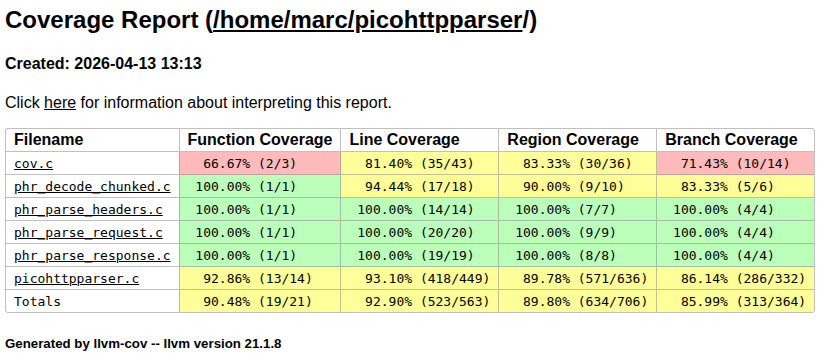
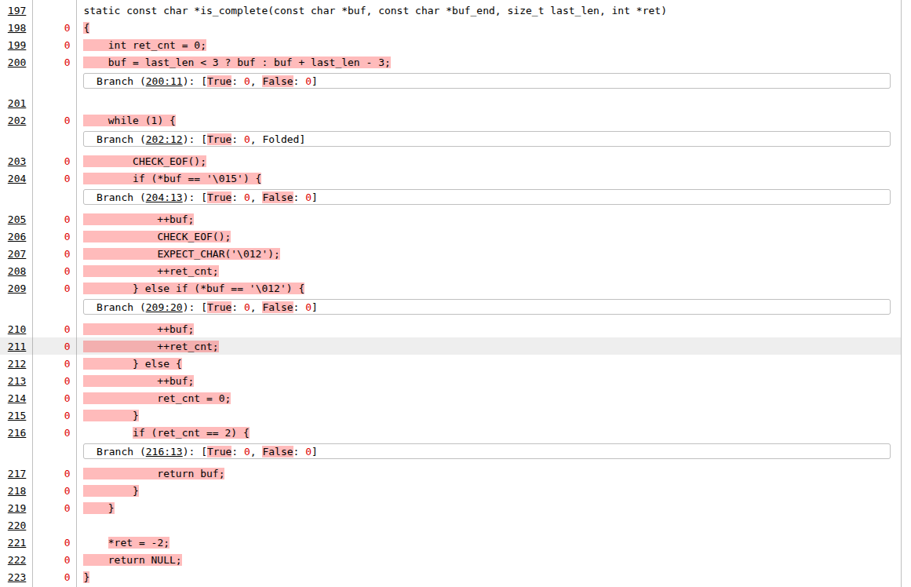
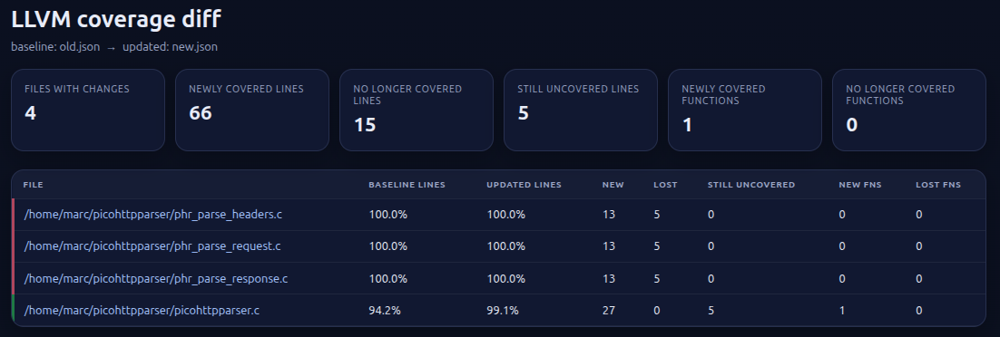
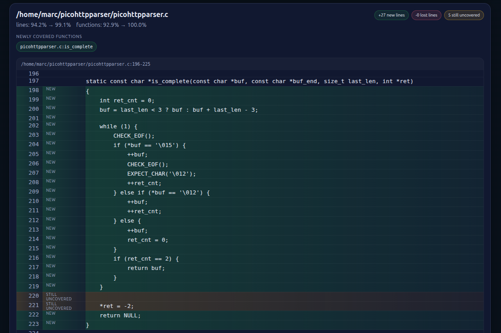

# cov-analysis - Fuzzing Code Coverage for AFL++, libFuzzer, and honggfuzz

Replacing `afl-cov` and `libfuzzer-cov` with modern coverage gathering and great features!

Version: 1.0.0

- [Introduction](#introduction)
- [Prerequisites](#prerequisites)
- [Supported Fuzzers](#supported-fuzzers)
- [Workflow](#workflow)
  - [Step 1: Build a Coverage Binary](#step-1-build-a-coverage-binary)
  - [Step 2: Generate Coverage Report](#step-2-generate-coverage-report)
  - [Step 3: Diff Two Coverage Reports](#step-3-diff-two-coverage-reports)
  - [Step 4: Identifying unstable code lines](#step-4-identifying-unstable-code-lines)
  - [Parallelized AFL Execution](#parallelized-afl-execution)
- [Usage Information](#usage-information)
  - [cov-analysis report (default)](#cov-analysis-report-default)
  - [cov-analysis build](#cov-analysis-build)
  - [cov-analysis driver](#cov-analysis-driver)
  - [cov-analysis diff](#cov-analysis-diff)
  - [cov-analysis stability](#cov-analysis-stability)
- [License](#license)

## Introduction

`cov-analysis` generates **LLVM source-based code coverage** reports from a fuzzing corpus. It auto-detects the on-disk layout used by [AFL++](https://github.com/AFLplusplus/AFLplusplus) (queue/crashes/timeouts directories, single or parallel), libFuzzer (flat corpus dir plus `crash-*`/`leak-*`/`oom-*` artifacts), and honggfuzz (flat corpus plus `SIG*.fuzz` crash files). It replays each input through a coverage-instrumented binary, merges the raw profiles, and produces HTML, text, and JSON reports via `llvm-profdata` and `llvm-cov`.

This is a rewrite of the original cov-analysis. Key changes in 1.0.0:
- New key feature: generate a diff report on coverage to a previous run
- New key feature: identify the lines in the code that are unstable (EXPLAIN HERE)
- Replaced gcov/lcov/genhtml with LLVM source-based coverage (`-fprofile-instr-generate`, `llvm-profdata`, `llvm-cov`) - faster, more accurate under optimization
- `cov-analysis build` sets compiler flags and builds the target; `cov-analysis driver` emits a ready-to-use `coverage_driver.c` for `LLVMFuzzerTestOneInput` harnesses
- `cov-analysis diff` generates an HTML diff report comparing coverage between two JSON exports
- Rewritten in bash (was Python)

## Prerequisites

- `clang` (any version down to 11)
- `llvm-profdata` and `llvm-cov` (matching the clang version; auto-detected)
- AFL++ (`afl-fuzz`), libafl, libfuzzer, Honggfuzz, ... - only needed to produce the corpus, not to run `cov-analysis`

## Supported Fuzzers

| Fuzzer     | Detected by                                | Input files replayed                                                          |
|------------|--------------------------------------------|-------------------------------------------------------------------------------|
| AFL++      | `<dir>/queue/` or `<dir>/*/queue/` exists  | `queue/id:*`, `crashes/id:*`, `timeouts/id:*`                                 |
| libFuzzer  | flat directory of files, no `queue/`       | all files except `crash-*`/`leak-*`/`oom-*`/`timeout-*`/`slow-unit-*`        |
| libafl     | flat directory of files, no `queue/`       | all files except `crash-*`/`leak-*`/`oom-*`/`timeout-*`/`slow-unit-*`        |
| honggfuzz  | flat directory of files, no `queue/`       | all files except `SIG*.fuzz` and `HONGGFUZZ.REPORT.TXT`                       |

For libFuzzer, libafl and honggfuzz, crash-like files (above) are still replayed, but under the `-T` timeout so a hanging input can't stall the run.

Override auto-detection with `--layout afl|flat`.

## Workflow

### Step 1: Build a Coverage Binary

Use `cov-analysis build` to set the correct compiler flags and build your target:

```bash
# Set up a coverage build (run once per build step)
cd /path/to/project-cov/
cov-analysis build ./configure --disable-shared
cov-analysis build make -j$(nproc)
```

`cov-analysis build` sets:
```
CC=clang  CXX=clang++
CFLAGS="-fprofile-instr-generate -fcoverage-mapping -DFUZZING_BUILD_MODE_UNSAFE_FOR_PRODUCTION=1"
LDFLAGS="-fprofile-instr-generate"
```

**Important:** `FUZZING_BUILD_MODE_UNSAFE_FOR_PRODUCTION=1` must match what was used during fuzzing - it disables the same checksums/HMACs that AFL++ bypassed.

#### For `LLVMFuzzerTestOneInput` harnesses

Generate a replay driver and link it against your coverage-instrumented library:

```bash
cov-analysis driver -o coverage_driver.c
clang -fprofile-instr-generate -fcoverage-mapping \
  -c coverage_driver.c -o coverage_driver.o
clang -fprofile-instr-generate \
  coverage_driver.o -L./build -ltarget -o cov
```

The driver loops over all file arguments, calls `LLVMFuzzerTestOneInput` for each, and installs a crash handler that flushes profiling data so crashing inputs still contribute to the report.

### Step 2: Generate Coverage Report

This step will a `llvm-cov` coverage` report with regions and branches that looks like this:




```bash
cd /path/to/project-cov/
cov-analysis -d /path/to/afl-fuzz-output/ -e "./cov @@"
```

To replay coverage with multiple workers, add `-t`:

```bash
cov-analysis -d /path/to/afl-fuzz-output/ -e "./cov @@" -t 8
```

`cov-analysis` will for AFL++:
1. Replay all `queue/id:*` files in batch (fast)
2. Replay `crashes/id:*` and `timeouts/id:*` one-by-one with a timeout
3. Merge `.profraw` profiles with `llvm-profdata`
4. Generate reports in `/path/to/afl-fuzz-output/cov/`

For libfuzzer/Honggfuzz `cov-analysis` will:
1. Replay all files in the directory
2. Crash files are replayed one-by-one with a timeout

Output:
```
/path/to/afl-fuzz-output/cov/
  html/index.html     ← browse this for annotated source coverage
  text/               ← text format, suitable for automated analysis
  summary.txt         ← per-file line/branch/function percentages
  coverage.json       ← machine-readable export
  coverage.profdata   ← merged profile (baseline for iterative improvement)
```

For stdin-based targets (binary reads from stdin, no file argument):

```bash
cov-analysis -d /path/to/afl-fuzz-output/ -e "./target"
```

#### libFuzzer corpus

```bash
cov-analysis -d /path/to/libfuzzer-corpus/ -e "./cov @@"
```

Corpus files are replayed in batch mode. If your libFuzzer run used `-artifact_prefix=./crashes/`, point a second run at that directory to cover crash inputs too — or move artifacts into the corpus dir beforehand.

#### honggfuzz workspace

```bash
cov-analysis -d /path/to/hfuzz-workdir/ -e "./cov @@"
```

`SIG*.fuzz` crash files are replayed under the `-T` timeout. The `HONGGFUZZ.REPORT.TXT` metadata file is ignored automatically.

### Step 3: Diff Two Coverage Reports

Compare coverage between two `llvm-cov` JSON exports and generate an HTML diff report:

```bash
cov-analysis diff coverage_old.json coverage_new.json
```

Note that if you specify the same output directory when generating a new report then the original `coverage_new.json` is renamed to `coverage_old.json` so this analysis can easily be performed.

The report is written to `<report-dir>/coverage_diff.html` and shows:
- Newly covered and no-longer-covered lines per file
- Newly covered and lost functions
- Source code snippets annotated with coverage change

If the JSON paths are omitted, `cov-analysis diff` defaults to `<report-dir>/coverage_old.json` and `<report-dir>/coverage.json`.

This is how the HTML report looks like:





### Step 4: Identifying unstable code lines

Ever wandered when AFL++'s afl-fuzz or libafl reported instability in a fuzz target what the offending lines in the code were?
Fret no more! The `stability` command will find that out for you :-)

```bash
cov-analysis stability -d ../afl/out -e "./cov @@"
```

This will give you the exact lines that are problematic, e.g.:
```
Stability Report
--------------------------------------------------------
Corpus size : 2 inputs
Runs        : 8
Stability   : 74.0% (91/123 executed lines stable)

~~ Variable-count lines (32 lines):
   Lines with varying hit counts:

  /prg/cov-analysis/tests/unstable.c:35-37
  /prg/cov-analysis/tests/unstable.c:43
  /prg/cov-analysis/tests/unstable.c:46-48
  /prg/cov-analysis/tests/unstable.c:51-52
  /prg/cov-analysis/tests/unstable.c:55-61
  /prg/cov-analysis/tests/unstable.c:64-66
  /prg/cov-analysis/tests/unstable.c:69-70
  /prg/cov-analysis/tests/unstable.c:75-85

[!] Unstable coverage detected.
```

### Parallelized AFL Execution

For parallel AFL runs (`afl-fuzz -o sync_dir`), point `-d` at the top-level sync directory. `cov-analysis` automatically discovers all fuzzer instance subdirectories:

```bash
cov-analysis -d /path/to/sync_dir/ -e "./cov @@"
```

## Usage Information

### cov-analysis report (default)

```
Usage: cov-analysis [report] [options]

Required:
  -d <dir>    Fuzzing output directory (AFL++, libFuzzer, or honggfuzz)
  -e <cmd>    Coverage command. Use @@ as input file placeholder.
              Omit @@ to feed input via stdin instead.

Optional:
  -o <dir>           Report output directory (default: <afl-dir>/cov)
  -t <num>           Parallel replay workers/forks (default: 1)
  -T <secs>          Timeout for crash/timeout replay (default: 5)
  --layout <kind>    Force layout: 'afl' or 'flat' (default: auto-detect)
  --ignore-regex <r> Filename regex to exclude from llvm-cov reports
                     (default: /usr/include/)
  -v                 Verbose output
  -q                 Quiet mode
  -V                 Print version and exit
  -h, --help         Print this help and exit
```

### cov-analysis build

```
Usage: cov-analysis build <build-command> [args...]

  Sets CC/CXX/CFLAGS/CXXFLAGS/LDFLAGS for LLVM source-based coverage and
  runs the given build command.
```

### cov-analysis driver

```
Usage: cov-analysis driver [-o output.c]

  Emits coverage_driver.c source to stdout (or to -o FILE).
  Use this for LLVMFuzzerTestOneInput harnesses to replay corpus files.

  The driver loops over all file arguments, calls LLVMFuzzerTestOneInput
  for each, and installs a crash handler that flushes profiling data so
  crashing inputs still contribute to the coverage report.

Options:
  -o <file>     Write driver source to FILE instead of stdout
```

### cov-analysis diff

```
Usage: cov-analysis diff [<OLD_JSON> <NEW_JSON>]

  Compare coverage between two llvm-cov JSON exports and generate an
  HTML diff report showing newly covered, lost, and still-uncovered
  lines and functions.

  Defaults to <report-dir>/coverage_old.json and <report-dir>/coverage.json.
```

### cov-analysis stability

```
Usage: cov-analysis stability [options]

  Run each corpus input N times with LLVM coverage, collect per-line hit
  counts, and flag lines where counts vary across runs as "unstable."
  Reports a stability percentage. If instability is found with the default
  4 runs, reruns for a total of 8 to confirm.

Required:
  -d <dir>    Fuzzing output directory (AFL++, libFuzzer, or honggfuzz)
  -e <cmd>    Coverage command. Use @@ as input file placeholder.
              Omit @@ to feed input via stdin instead.

Optional:
  -n <num>           Number of runs per corpus pass (default: 4)
  -s <prefix>        Only consider source lines whose file path contains
                     this prefix (e.g. -s src/)
  -t <num>           Parallel replay workers (default: 1)
  --layout <kind>    Force layout: 'afl' or 'flat' (default: auto-detect)
  -v                 Verbose output
  -q                 Quiet mode (suppress all [+] output)
  -V                 Print version and exit
  -h, --help         Print this help and exit
```

The command outputs a **Stability Report** showing corpus size, number of runs, and the stability percentage (stable executed lines / total executed lines). If unstable lines are found, they are listed with file paths and line number ranges.

Examples:

```bash
cov-analysis stability -d out/ -e "./cov @@"
cov-analysis stability -d out/ -e "./cov @@" -n 8 -s src/
cov-analysis stability -d ./corpus -e "./cov @@" -t 4
```

## License

`cov-analysis` is released under the **GNU Affero General Public License 3**.
